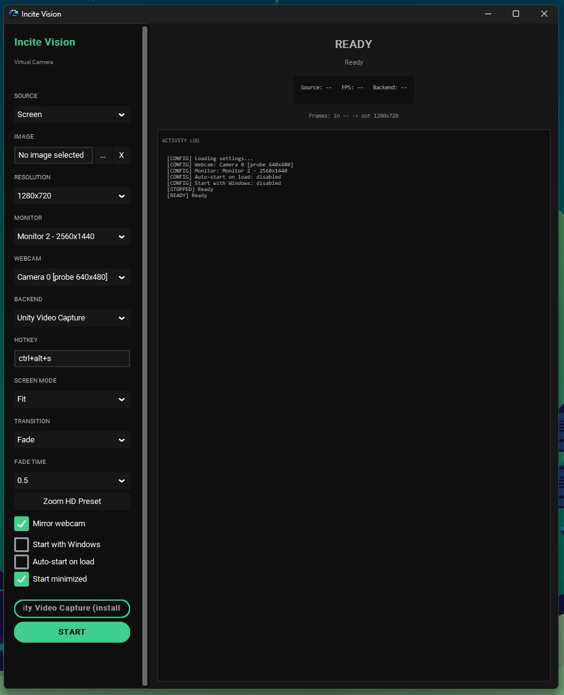

# Incite Vision

A Windows desktop application providing high-performance virtual camera management with seamless switching between webcam and screen capture sources.

## Overview

Incite Vision is a virtual camera manager that allows content creators, streamers, and professionals to switch between webcam and screen capture sources instantly via hotkey. The application creates a system-wide virtual camera visible to all video conferencing, streaming, and recording applications.



## Features

- **Virtual Camera**: System-wide webcam feed visible to all applications (Zoom, Teams, OBS, etc.)
- **Webcam Capture**: Live webcam feed at configurable resolution
- **Screen Capture**: Full screen or specific monitor selection
- **Instant Source Switching**: Toggle between webcam/screen via global hotkey (<100ms latency)
- **Auto-Driver Installation**: Automatic UnityCapture/OBS driver setup
- **System Tray Integration**: Minimize to tray with accessible controls
- **Auto-Start**: Launch with Windows for hands-free operation
- **Performance**: 60 FPS steady performance with <50MB RAM usage
- **Portable**: Single executable distribution
- **Fallback Handling**: Automatic source switching if primary source becomes unavailable
- **Letterbox Fit**: Preserve aspect ratio when scaling to target resolution

## Documentation

Detailed documentation is available in the [`docs/`](./docs) directory:

- [Business Requirements Document (BRD)](./docs/BRD.md) - Market analysis, business objectives, and success metrics
- [Product Requirements Document (PRD)](./docs/PRD.md) - Feature specifications, user interactions, and technical requirements
- [Functional Requirements Document (FRD)](./docs/FRD.md) - System architecture, module design, data flow, and error handling

## Quick Start

### Prerequisites

- Windows 10/11 (64-bit)
- Python 3.12+
- Administrator privileges (for driver installation)

### Installation

1. Clone or download the repository
2. Install dependencies:
   ```bash
   pip install -r requirements.txt
   ```
3. Run the application:
   ```bash
   python incite_vision.py
   ```
   Or use the built executable:
    ```bash
    dist/incite_vision.exe
    ```

### Usage

- Launch the application - it will appear in your system tray
- Double-click the tray icon or select "Show Window" to open the main interface
- Click "START" to begin streaming via the virtual camera
- Use your configured hotkey (default: Ctrl+Alt+S) to switch between webcam and screen capture
- Right-click the tray icon for additional options (Start/Stop Streaming, Quit)

## Configuration

Settings are stored in `settings.json` and include:
- Resolution (default: 1920x1080)
- Preferred webcam index
- Preferred monitor ID
- Hotkey binding
- Virtual backend (auto/unity/obs)
- Active source (webcam/screen)
- Start with Windows (bool)
- Auto-start on load (bool)
- Start minimized (bool)

## Building from Source

To build the executable yourself:

1. Ensure you have Python 3.12+ installed
2. Install build dependencies:
   ```bash
   pip install pyinstaller
   ```
3. Build the executable:
   ```bash
   pyinstaller --onefile --windowed incite_vision.py
   ```
4. The executable will be created in the `dist/` directory

## Project Structure

```
Incite Vision/
├── incite_vision.py      # Main application
├── settings.json         # User preferences
├── requirements.txt      # Python dependencies
├── BUILD.md              # Build instructions
├── DESIGN.md             # Technical design details
├── docs/                 # Documentation
│   ├── BRD.md            # Business Requirements
│   ├── PRD.md            # Product Requirements
│   ├── FRD.md            # Functional Requirements
│   └── README.md         # Documentation index
├── driver/               # UnityCapture/OBS driver files
├── dist/                 # Built executable
├── build/                # Build artifacts
└── __pycache__/          # Python cache
```

## License

This project is licensed under the MIT License - see the LICENSE file for details.

## Version

**Current Version**: 1.0.0  
**Last Updated**: 2026-04-17

## Disclaimer

This software is provided "as is", without warranty of any kind, express or implied, including but not limited to the warranties of merchantability, fitness for a particular purpose and noninfringement. In no event shall the authors or copyright holders be liable for any claim, damages or other liability, whether in an action of contract, tort or otherwise, arising from, out of or in connection with the software or the use or other dealings in the software.